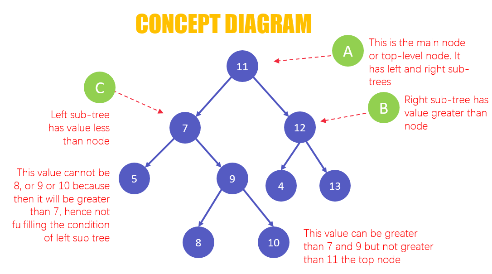
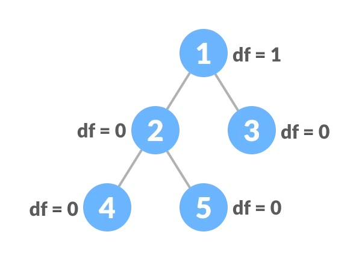

# TREE



Trees are like linked lists in that nodes are connected together by pointers. However, unlike linked lists, a tree can connect to multiple different nodes. 

## Terms to know
* Binary Trees is a form of a tree whose nodes cannot have more than two children. Each node of the binary tree has two pointers associated with it, one points to the left child, and the other points to the right child of the node. It is an unordered tree having no fixed organized structure for the arrangement of nodes.
* Balance Binary Search Trees - A balanced binary tree, also referred to as a height-balanced binary tree, is defined as a binary tree in which the height of the left and right subtree of any node differ by not more than 1.


# Syntax

```
# Creating node class
class Node:
    def __init__(self, data):
        self.data = data
        self.leftChild = None
        self.rightChild = None

    # print function
    def PrintTree(self):
        print(self.data)

# Creating a root node
root = Node(13)
root.PrintTree()


```

# Insert
```

    def insert(self, data):
        # if value is lesser than the value of the parent node
        if data < self.data:
            if self.leftChild:
                self.leftChild.insert(data)
            else:
                self.leftChild = Node(data)
                return
        # if value is greater than the value of the parent node        
        else:
            if self.rightChild:
                # if we still need to move towards the right subtree
                self.rightChild.insert(data)
            else:
                self.rightChild = Node(data)
                return

```

# Problem to Solve
```
Create a a function to search the tree for a specific value. Try to figure it out before looking at the answer. 

```


[Link to the solution](solution3.py)